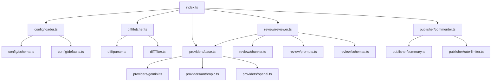

# Architecture Deep-Dive

## 1. Component Dependency Graph



## 2. Data Flow (per PR event)

| Stage | Module | Input | Output |
|---|---|---|---|
| Bootstrap | `index.ts` | GitHub webhook payload | `ActionContext` |
| Config | `config/loader.ts` | `.reviewbot.yml` + action inputs | `ReviewBotConfig` |
| Diff Fetch | `diff/fetcher.ts` | PR number | `RawDiffFile[]` |
| Diff Parse | `diff/parser.ts` | Raw patches | `DiffHunk[]` |
| Filter | `diff/filter.ts` | Hunks + globs | `FilteredDiff` |
| Chunk | `review/chunker.ts` | Filtered diff | `ReviewChunk[]` |
| AI Review | `review/reviewer.ts` | Chunks + config | `ReviewFinding[]` |
| Publish | `publisher/commenter.ts` | Findings + context | GitHub Review |

## 3. Module Responsibilities

### `src/index.ts` — Orchestrator
Pure orchestration. No business logic. Every stage is an async function with explicit I/O types.

### `src/config/` — Configuration
- `schema.ts` → Zod schema for `.reviewbot.yml`
- `defaults.ts` → Fallback values
- `loader.ts` → Fetch YAML → parse → validate → merge

**Merge priority:** action inputs > `.reviewbot.yml` > defaults

### `src/diff/` — Diff Acquisition
- `fetcher.ts` → GitHub API call for PR files
- `parser.ts` → Unified diff → `DiffHunk[]`
- `filter.ts` → Glob include/exclude

### `src/review/` — AI Engine
- `chunker.ts` → Split into token-safe chunks
- `prompts.ts` → System + user prompt templates
- `reviewer.ts` → Provider-agnostic AI review orchestrator
- `schemas.ts` → Zod validation of AI output

### `src/providers/` — AI Provider Abstraction ($0 default)
- `base.ts` → `AIProvider` interface (swap providers via config)
- `gemini.ts` → Google Gemini (free tier: 15 RPM, 1M tokens/day, $0)
- `anthropic.ts` → Anthropic Claude (paid, optional upgrade)
- `openai.ts` → OpenAI GPT (paid, optional upgrade)

### `src/publisher/` — Comment Publisher
- `commenter.ts` → Inline review comments
- `summary.ts` → Aggregate stats summary
- `rate-limiter.ts` → Token bucket for GitHub API

### `src/utils/` — Utilities
- `logger.ts` → Structured logging via `@actions/core`
- `retry.ts` → Exponential backoff with jitter
- `crypto.ts` → Token estimation, content hashing

## 4. Dependency Injection

All external clients are created in `index.ts` and passed via `ActionContext`:

```typescript
interface ActionContext {
  octokit: Octokit;
  aiProvider: AIProvider;  // Gemini (free) | Claude | OpenAI
  owner: string;
  repo: string;
  pullNumber: number;
  commitSha: string;
}
```

No module creates its own API client. This enables testability and single-point auth.

## 5. Error Strategy

```typescript
class ReviewBotError extends Error {
  constructor(message: string, public code: ErrorCode, public retryable: boolean) {}
}
class ConfigError extends ReviewBotError {}
class DiffError extends ReviewBotError {}
class AIError extends ReviewBotError {}
class PublishError extends ReviewBotError {}
```

- **Retryable** (429 rate limit) → `withRetry()` handles
- **Soft failures** (unparseable file) → warn, skip, continue
- **Hard failures** (invalid API key) → `core.setFailed()`, exit

## 6. Concurrency

- Chunks are reviewed in parallel via `Promise.allSettled()` with semaphore
- `config.maxConcurrency` controls parallelism (default: 3)
- Rate limiting for both AI provider and GitHub API

## 7. No Server / No Ports

ReviewBot is a GitHub Action, not a web service. No HTTP listeners, no ports, no database. Start → Process → Comment → Exit.

## 8. Cost Model

| Provider | Free Tier | Paid Tier |
|---|---|---|
| **Google Gemini** (default) | 15 RPM, 1,500 req/day, 1M tokens/day — **$0** | $0.075/1M input, $0.30/1M output |
| Anthropic Claude | None | ~$3/1M input, ~$15/1M output |
| OpenAI GPT-4o | None | ~$2.50/1M input, ~$10/1M output |

> **Start free with Gemini.** Upgrade to Claude/OpenAI when you need higher quality or higher volume.

## 9. Token Budget

| Component | Tokens |
|---|---|
| System Prompt | ~2,000 (fixed) |
| Repo Config | ~500 (variable) |
| Diff Chunk | ≤8,000 (configurable) |
| Response Budget | ~4,000 (reserved) |
| Total per call | ≤15,000 |
